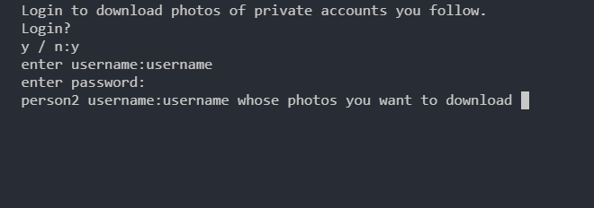
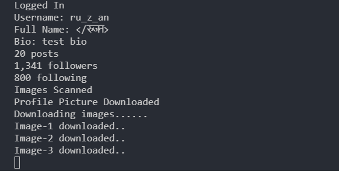

# Instagram-Photo-Scraper
Python bot that downloads instagram photos of a given user.

# How it works?
- Downloads profile pic and all the images of a user creating a separating folder 
- Enter the person's username whose photos you want to download 
- login to instagram to download images of private account.  

# Screenshots 

# Requirements 
- selenium==3.141.0
- download chromeDriver according to your chrome version <a href="https://chromedriver.chromium.org/downloads"> here </a>
- requests==2.21.0
